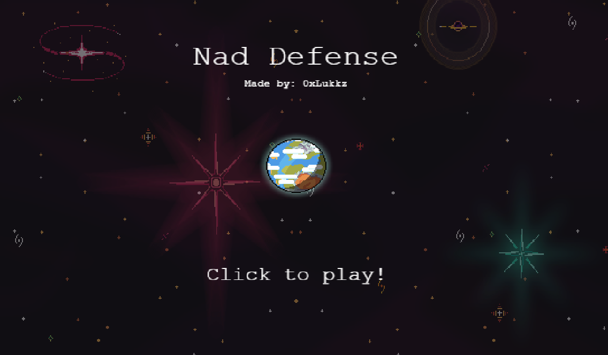
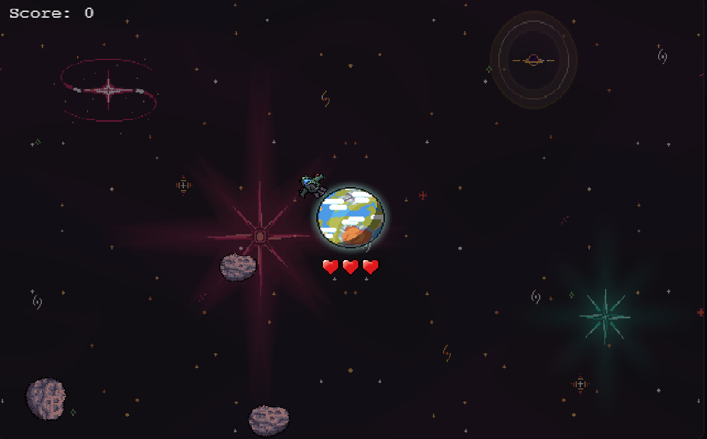
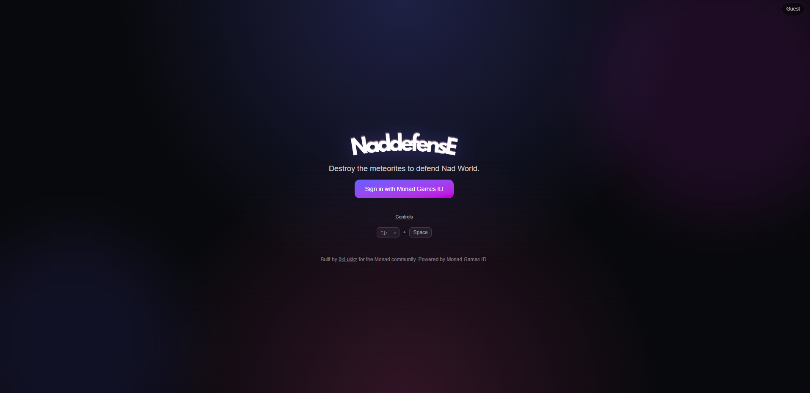

# Nad Defense 🚀



**Nad Defense** is a fun, minimalist arcade-style space defense game built using **Phaser 4** and **Next.js 15**, integrated with **Monad Games ID** for seamless login and wallet connectivity.

Defend Nad World by rotating your ship around the planet, destroying incoming meteorites, and competing for the highest score!  
The game was created for the **Monad Community** by [0xLukkz](https://x.com/0xLukkz).

---

## 🌍 Live Demo

Play the game now: [**nad-defense.vercel.app**](https://nad-defense.vercel.app/)

> 💡 _Make sure you have a registered username with Monad Games ID to play._

---

## 🎮 Features

-   **Seamless login** with Monad Games ID.
-   Phaser 4-powered **arcade gameplay**.
-   Minimalist **responsive UI** built with Tailwind CSS.
-   Local leaderboard and score tracking. (coming in next update)

---

## 🕹 How To Play

Currently, Nad Defense supports **keyboard controls only**.

| Key                | Action                                      |
| ------------------ | ------------------------------------------- |
| **← → Arrow Keys** | Rotate the ship around the Monad Planet.    |
| **Spacebar**       | Fire the main weapon to destroy meteorites. |

Survive as long as you can and aim for a **high score**!

---

## 🧩 Tech Stack

| Technology                               | Purpose                         |
| ---------------------------------------- | ------------------------------- |
| [Next.js 15](https://nextjs.org/)        | Frontend framework & deployment |
| [Phaser 4](https://phaser.io/)           | Game engine & rendering         |
| [Tailwind CSS](https://tailwindcss.com/) | Styling and UI components       |
| [Monad Games ID](https://monadclip.fun/) | Wallet integration and login    |
| [Vercel](https://vercel.com/)            | Hosting and deployment          |

---

## 📸 Screenshots

| Gameplay                                                   | Login Screen                                         |
| ---------------------------------------------------------- | ---------------------------------------------------- |
|  |  |

---

## ⚡ Development

### Prerequisites

-   Node.js 18+
-   npm or yarn
-   A Monad Games ID account

### Installation

```bash
# Clone the repo
git clone https://github.com/LucasETrigo/nad-defense.git

# Navigate into the project
cd nad-defense

# Install dependencies
npm install

# Start the development server
npm run dev
```
